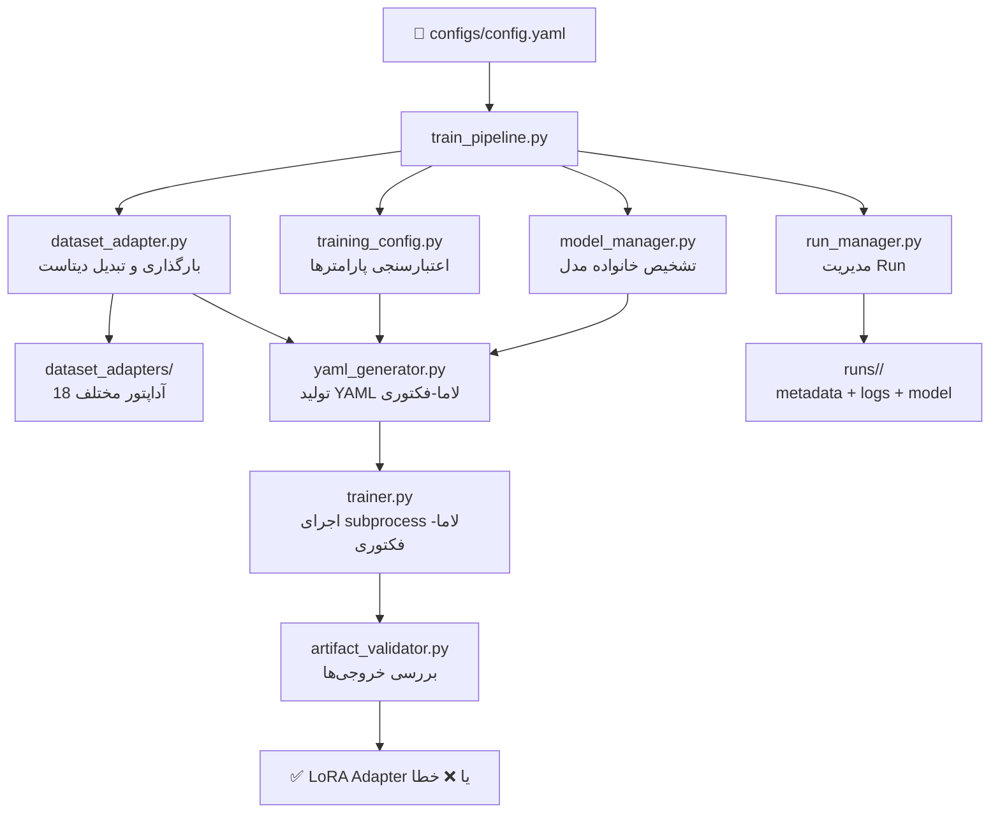
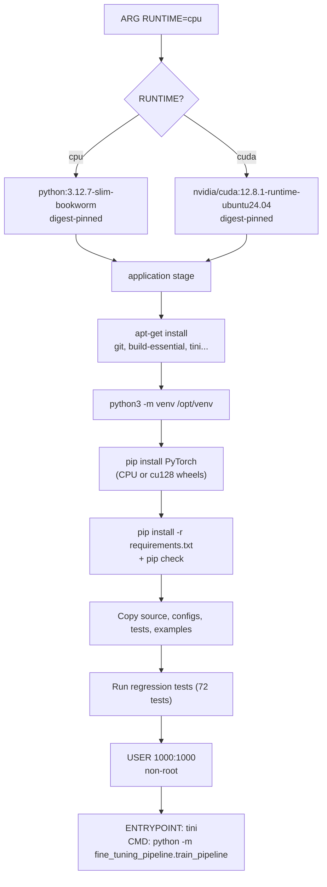

# 📊 گزارش تحلیل کامل پروژه: Automatic LLM Fine-tuning Pipeline

> [!NOTE]
> این گزارش شامل آنالیز معماری، ساختار کد، مراحل Docker، تست، و تحویل به مشتری است.

---

## 1. خلاصه اجرایی پروژه

| آیتم | جزئیات |
|------|--------|
| **نام** | Automatic LLM Fine-tuning Pipeline |
| **نسخه** | v1.0.0 |
| **لایسنس** | Apache License 2.0 |
| **زبان** | Python 3.12.7 (حداقل 3.11+) |
| **موتور آموزش** | LLaMA-Factory (upstream SFT engine) |
| **خروجی** | LoRA Adapter (همراه مدل پایه) |
| **وضعیت** | سورس آماده انتشار؛ Docker و GPU هنوز عملاً تست نشده |

### هدف پروژه
یک پایپلاین **Configuration-Driven** برای Fine-tuning مدل‌های زبانی بزرگ (LLM). کاربر فقط یک فایل YAML تنظیم می‌کند و پایپلاین به صورت خودکار:
1. دیتاست را لود و نرمال‌سازی می‌کند
2. سازگاری مدل/template را بررسی می‌کند
3. فایل‌های تنظیمات LLaMA-Factory را تولید می‌کند
4. آموزش را اجرا می‌کند
5. خروجی‌ها را اعتبارسنجی می‌کند

---

## 2. معماری سیستم



### جریان اجرای واقعی

```text
1. بارگذاری YAML → اعتبارسنجی ساختار
2. ایجاد دایرکتوری Run ایزوله + snapshot تنظیمات
3. تشخیص خانواده مدل (Qwen/Llama/Mistral/Gemma) از نام + HuggingFace config
4. اعتبارسنجی پارامترهای آموزش (method, epochs, lr, batch_size...)
5. Snapshot دیتاست + بارگذاری از آداپتور source
6. تشخیص schema + نرمال‌سازی به instruction/input/output
7. نوشتن JSON نرمال، dataset_info.json، resolved config، training YAML
8. اجرای LLaMA-Factory CLI به صورت subprocess
9. بررسی آرتیفکت‌های خروجی (adapter_config.json + adapter_model.safetensors)
10. ثبت وضعیت success/failed در metadata.json
```

---

## 3. ساختار پروژه

```text
automatic-llm-finetuning-pipeline/
├── 📁 src/fine_tuning_pipeline/          ← کد اصلی (11 ماژول + 18 آداپتور)
│   ├── train_pipeline.py                 ← نقطه ورود اصلی
│   ├── model_manager.py                  ← تشخیص مدل و template
│   ├── training_config.py                ← اعتبارسنجی تنظیمات آموزش
│   ├── dataset_adapter.py                ← فاساد دیتاست
│   ├── dataset_adapters/                 ← 18 آداپتور: JSON, JSONL, CSV, Parquet, HF, ChatML...
│   │   ├── base.py                       ← قرارداد پایه آداپتورها
│   │   ├── registry.py                   ← رجیستری با نمره‌دهی اطمینان
│   │   ├── alpaca_adapter.py
│   │   ├── sharegpt_adapter.py
│   │   ├── openai_chat_adapter.py
│   │   └── ... (15 آداپتور دیگر)
│   ├── run_manager.py                    ← مدیریت lifecycle اجرا
│   ├── artifact_validator.py             ← بررسی خروجی مدل
│   ├── yaml_generator.py                 ← تولید YAML لاما-فکتوری
│   ├── trainer.py                        ← اجرای subprocess آموزش
│   ├── dataset_config_generator.py       ← تولید dataset_info.json
│   └── dataset_loader.py                ← اعتبارسنجی ردیف‌های SFT
│
├── 📁 configs/                           ← فایل‌های تنظیمات
│   ├── config.yaml                       ← تنظیمات پیش‌فرض (Qwen2.5)
│   ├── qwen_example.yaml                 ← مثال CPU کوچک
│   ├── llama_example.yaml                ← مثال Llama 3 (نیاز به GPU)
│   └── huggingface_dataset_example.yaml  ← مثال دیتاست HuggingFace
│
├── 📁 docker/                            ← فایل‌های Docker
│   ├── Dockerfile                        ← Multi-stage: CPU + CUDA 12.8
│   └── pytorch-requirements.txt          ← نسخه‌های ثابت PyTorch
│
├── 📁 tests/                             ← 10 فایل تست (72 تست)
│   ├── test_pipeline.py
│   ├── test_model_manager.py
│   ├── test_training_config.py
│   ├── test_dataset_schema_adapters.py
│   ├── test_dataset_source_adapters.py
│   ├── test_dataset_registry.py
│   ├── test_run_management.py
│   ├── test_docker_support.py
│   └── test_repository_layout.py
│
├── 📁 docs/                              ← 12 فایل مستندات
│   ├── architecture.md
│   ├── docker.md
│   ├── installation.md
│   ├── configuration.md
│   ├── usage.md
│   ├── acceptance_report.md
│   └── ... (6 مستند دیگر)
│
├── 📁 examples/datasets/                 ← 3 دیتاست نمونه
│   ├── alpaca_demo.json (2 ردیف)
│   ├── rag_qa.json
│   └── openai_chat.json
│
├── requirements.txt                      ← وابستگی‌ها (pinned)
├── pyproject.toml                        ← metadata بسته
├── environment.yml                       ← Conda bootstrap
├── .dockerignore                         ← default-deny context
├── .gitignore
├── RELEASE_NOTES.md
├── CHANGELOG.md
└── RELEASE_CHECKLIST.md
```

---

## 4. تحلیل ماژول‌ها

### 4.1 ماژول‌های اصلی

| ماژول | خطوط | مسئولیت | کیفیت |
|-------|-------|---------|--------|
| [train_pipeline.py](file:///c:/Users/s.tabatabaei/Documents/saberprojects/automatic-llm-finetuning-pipeline/src/fine_tuning_pipeline/train_pipeline.py) | 264 | ارکستراسیون کامل | ✅ خوب – خطایابی کامل |
| [model_manager.py](file:///c:/Users/s.tabatabaei/Documents/saberprojects/automatic-llm-finetuning-pipeline/src/fine_tuning_pipeline/model_manager.py) | 299 | تشخیص مدل + template | ✅ عالی – multi-source detection |
| [training_config.py](file:///c:/Users/s.tabatabaei/Documents/saberprojects/automatic-llm-finetuning-pipeline/src/fine_tuning_pipeline/training_config.py) | 229 | اعتبارسنجی typed | ✅ عالی – strict validation |
| [run_manager.py](file:///c:/Users/s.tabatabaei/Documents/saberprojects/automatic-llm-finetuning-pipeline/src/fine_tuning_pipeline/run_manager.py) | 238 | lifecycle + metadata | ✅ خوب – atomic writes |
| [yaml_generator.py](file:///c:/Users/s.tabatabaei/Documents/saberprojects/automatic-llm-finetuning-pipeline/src/fine_tuning_pipeline/yaml_generator.py) | 95 | تولید YAML | ✅ خوب |
| [trainer.py](file:///c:/Users/s.tabatabaei/Documents/saberprojects/automatic-llm-finetuning-pipeline/src/fine_tuning_pipeline/trainer.py) | 35 | subprocess launch | ⚠️ ساده – بدون timeout/retry |
| [artifact_validator.py](file:///c:/Users/s.tabatabaei/Documents/saberprojects/automatic-llm-finetuning-pipeline/src/fine_tuning_pipeline/artifact_validator.py) | 68 | بررسی خروجی | ✅ خوب |
| [dataset_adapter.py](file:///c:/Users/s.tabatabaei/Documents/saberprojects/automatic-llm-finetuning-pipeline/src/fine_tuning_pipeline/dataset_adapter.py) | 71 | فاساد | ✅ خوب |

### 4.2 مدل‌های پشتیبانی‌شده

| خانواده | Template | وضعیت تست |
|---------|----------|-----------|
| Qwen / Qwen2 / Qwen2.5 | `qwen` | ✅ آموزش واقعی + inference |
| Meta Llama 2/3 | `llama2` / `llama3` | ⚠️ فقط smoke test |
| Mistral | `mistral` | ⚠️ فقط smoke test |
| Gemma / Gemma2 / Gemma3 | `gemma` / `gemma2` / `gemma3` | ⚠️ فقط smoke test |

### 4.3 فرمت‌های دیتاست

| فرمت منبع | فرمت Schema | وضعیت |
|-----------|-------------|--------|
| JSON, JSONL, CSV, Parquet | Alpaca, Instruction/Response | ✅ |
| HuggingFace Datasets | Prompt/Completion, QA, RAG QA | ✅ |
| Raw ChatML Text | ShareGPT, OpenAI Chat, ChatML | ✅ |
| – | DPO | ❌ شناسایی بدون آموزش |

### 4.4 وابستگی‌های کلیدی

| بسته | نسخه | نقش |
|------|-------|------|
| PyYAML | 6.0.3 | پارسر تنظیمات |
| transformers | 5.8.0 | بارگذاری مدل HuggingFace |
| accelerate | 1.11.0 | شتاب‌دهنده آموزش |
| peft | 0.18.1 | LoRA adapter |
| trl | 0.24.0 | Reinforcement Learning tools |
| datasets | 4.0.0 | بارگذاری دیتاست HF |
| torch | 2.11.0 | فریم‌ورک PyTorch |
| LLaMA-Factory | git@97b32d3 | موتور آموزش (pinned commit) |

---

## 5. تحلیل Docker

### 5.1 معماری Dockerfile



### 5.2 نقاط قوت Docker

- ✅ **Base images با digest pin** – تکرارپذیری
- ✅ **Multi-stage CPU/CUDA** – یک Dockerfile برای هر دو
- ✅ **Default-deny `.dockerignore`** – فقط فایل‌های لازم
- ✅ **Non-root execution** – امنیت
- ✅ **Tini init process** – مدیریت سیگنال صحیح
- ✅ **Build-time tests** – تست‌ها در زمان ساخت اجرا می‌شوند
- ✅ **PyTorch constraint file** – جلوگیری از تعویض ناخواسته wheel

### 5.3 نقاط ضعف و ریسک‌ها

- ⚠️ **هیچ Docker build واقعی انجام نشده** (Docker روی هاست فعلی نصب نیست)
- ⚠️ **بدون docker-compose.yml** – مدیریت mount‌ها دستی است
- ⚠️ **بدون health check**
- ⚠️ **بدون multi-stage build optimization** (builder vs runtime)
- ⚠️ **GPU اصلاً تست نشده**

---

## 6. 🐳 مراحل Docker – گام‌به‌گام

### مرحله ۶.۱: پیش‌نیازها

```powershell
# 1. نصب Docker Desktop روی ویندوز
# دانلود از: https://docs.docker.com/desktop/install/windows-install/
# مطمئن شوید Linux containers فعال است (نه Windows containers)

# 2. بررسی نصب Docker
docker version
docker info

# 3. فضای دیسک کافی (حداقل 20GB برای image + مدل)
docker system df
```

### مرحله ۶.۲: ساخت Docker Image (CPU)

```powershell
# از ریشه پروژه اجرا کنید
cd c:\Users\s.tabatabaei\Documents\saberprojects\automatic-llm-finetuning-pipeline

# ساخت image – بسته به سرعت اینترنت 10-30 دقیقه
docker build -f docker/Dockerfile -t automatic-llm-finetuner:1.0.0 .

# بررسی ساخت موفق
docker images automatic-llm-finetuner
```

> [!IMPORTANT]
> در صورت خطا در مرحله `pip install`، ممکن است نیاز به VPN یا proxy باشد چون به PyPI، Docker Hub، و GitHub دسترسی لازم است.

### مرحله ۶.۳: ساخت Docker Image (CUDA 12.8)

```powershell
# فقط اگر سرور مقصد GPU NVIDIA دارد
docker build -f docker/Dockerfile --build-arg RUNTIME=cuda `
  -t automatic-llm-finetuner:1.0.0-cuda .
```

### مرحله ۶.۴: تست‌های اولیه Image

```powershell
# 1. بررسی وابستگی‌ها
docker run --rm automatic-llm-finetuner:1.0.0 python -m pip check

# 2. اجرای تست‌ها در container
docker run --rm automatic-llm-finetuner:1.0.0 python -m unittest discover -s tests -v

# 3. بررسی بارگذاری config پیش‌فرض
docker run --rm automatic-llm-finetuner:1.0.0 `
  python -c "from fine_tuning_pipeline.train_pipeline import load_config; print(load_config()['model']['name'])"

# 4. مشاهده وابستگی‌های نصب‌شده
docker run --rm automatic-llm-finetuner:1.0.0 cat /opt/deployment-requirements.txt

# 5. ذخیره digest ایمیج
docker image inspect automatic-llm-finetuner:1.0.0 --format '{{.Id}}'
```

### مرحله ۶.۵: ایجاد دایرکتوری‌های Mount

```powershell
# ایجاد پوشه‌های datasets و runs در ریشه پروژه
New-Item -ItemType Directory -Force -Path .\datasets, .\runs | Out-Null
```

### مرحله ۶.۶: اجرای آموزش با دیتاست Demo

```powershell
# اجرای آموزش با تنظیمات پیش‌فرض (Qwen2.5-0.5B + alpaca_demo)
docker run --rm `
  --mount "type=bind,source=$($PWD.Path)/configs,target=/app/configs,readonly" `
  --mount "type=bind,source=$($PWD.Path)/datasets,target=/app/datasets,readonly" `
  --mount "type=bind,source=$($PWD.Path)/runs,target=/app/runs" `
  --mount type=volume,source=llm-hf-cache,target=/cache/huggingface `
  automatic-llm-finetuner:1.0.0
```

### مرحله ۶.۷: اجرا با دیتاست سفارشی

```powershell
# 1. دیتاست خود را در پوشه datasets/ قرار دهید
Copy-Item .\my_dataset.json .\datasets\

# 2. فایل configs/config.yaml را ویرایش کنید:
#    dataset:
#      path: ../datasets/my_dataset.json
#      name: my_custom_dataset
#      source_format: auto
#      format: auto

# 3. اجرا
docker run --rm `
  --mount "type=bind,source=$($PWD.Path)/configs,target=/app/configs,readonly" `
  --mount "type=bind,source=$($PWD.Path)/datasets,target=/app/datasets,readonly" `
  --mount "type=bind,source=$($PWD.Path)/runs,target=/app/runs" `
  --mount type=volume,source=llm-hf-cache,target=/cache/huggingface `
  automatic-llm-finetuner:1.0.0
```

### مرحله ۶.۸: اجرا روی سرور GPU

```bash
# ⚠️ روی سرور لینوکس با NVIDIA GPU
# پیش‌نیاز: NVIDIA Driver + NVIDIA Container Toolkit

# 1. بررسی GPU
docker run --rm --gpus all automatic-llm-finetuner:1.0.0-cuda \
  python -c "import torch; print(torch.__version__, torch.version.cuda); assert torch.cuda.is_available(); print(torch.cuda.get_device_name(0))"

# 2. اجرای آموزش با GPU
docker run --rm --gpus all --shm-size=2g \
  --mount "type=bind,source=$(pwd)/configs,target=/app/configs,readonly" \
  --mount "type=bind,source=$(pwd)/datasets,target=/app/datasets,readonly" \
  --mount "type=bind,source=$(pwd)/runs,target=/app/runs" \
  --mount type=volume,source=llm-hf-cache,target=/cache/huggingface \
  automatic-llm-finetuner:1.0.0-cuda
```

### مرحله ۶.۹: ایجاد docker-compose.yml (پیشنهادی)

> [!TIP]
> برای ساده‌تر شدن اجرا، یک `docker-compose.yml` بسازید:

```yaml
# docker-compose.yml (در ریشه پروژه)
version: '3.8'

services:
  finetuner-cpu:
    build:
      context: .
      dockerfile: docker/Dockerfile
      args:
        RUNTIME: cpu
    image: automatic-llm-finetuner:1.0.0
    volumes:
      - ./configs:/app/configs:ro
      - ./datasets:/app/datasets:ro
      - ./runs:/app/runs
      - llm-hf-cache:/cache/huggingface
    environment:
      - HF_TOKEN=${HF_TOKEN:-}

  finetuner-gpu:
    build:
      context: .
      dockerfile: docker/Dockerfile
      args:
        RUNTIME: cuda
    image: automatic-llm-finetuner:1.0.0-cuda
    volumes:
      - ./configs:/app/configs:ro
      - ./datasets:/app/datasets:ro
      - ./runs:/app/runs
      - llm-hf-cache:/cache/huggingface
    environment:
      - HF_TOKEN=${HF_TOKEN:-}
    deploy:
      resources:
        reservations:
          devices:
            - driver: nvidia
              count: all
              capabilities: [gpu]
    shm_size: '2g'

volumes:
  llm-hf-cache:
```

```powershell
# استفاده
docker compose build finetuner-cpu
docker compose run --rm finetuner-cpu

# یا با GPU
docker compose run --rm finetuner-gpu
```

---

## 7. 🧪 مراحل تست – گام‌به‌گام

### مرحله ۷.۱: تست‌های واحد (Unit Tests) – بدون Docker

```powershell
# فعال‌سازی virtual environment
cd c:\Users\s.tabatabaei\Documents\saberprojects\automatic-llm-finetuning-pipeline
.\.venv\Scripts\Activate.ps1

# اجرای کل سوئیت تست (72 تست)
python -m unittest discover -s tests -v

# نتیجه مورد انتظار: 72 passed
```

### مرحله ۷.۲: دسته‌بندی تست‌ها

| فایل تست | تعداد | پوشش |
|----------|-------|------|
| [test_pipeline.py](file:///c:/Users/s.tabatabaei/Documents/saberprojects/automatic-llm-finetuning-pipeline/tests/test_pipeline.py) | ~20 | lifecycle کامل پایپلاین |
| [test_model_manager.py](file:///c:/Users/s.tabatabaei/Documents/saberprojects/automatic-llm-finetuning-pipeline/tests/test_model_manager.py) | ~10 | تشخیص مدل + سازگاری |
| [test_training_config.py](file:///c:/Users/s.tabatabaei/Documents/saberprojects/automatic-llm-finetuning-pipeline/tests/test_training_config.py) | ~15 | اعتبارسنجی تنظیمات |
| [test_dataset_schema_adapters.py](file:///c:/Users/s.tabatabaei/Documents/saberprojects/automatic-llm-finetuning-pipeline/tests/test_dataset_schema_adapters.py) | ~10 | تبدیل schema |
| [test_dataset_source_adapters.py](file:///c:/Users/s.tabatabaei/Documents/saberprojects/automatic-llm-finetuning-pipeline/tests/test_dataset_source_adapters.py) | ~8 | بارگذاری فرمت‌ها |
| [test_dataset_registry.py](file:///c:/Users/s.tabatabaei/Documents/saberprojects/automatic-llm-finetuning-pipeline/tests/test_dataset_registry.py) | ~3 | رجیستری آداپتورها |
| [test_run_management.py](file:///c:/Users/s.tabatabaei/Documents/saberprojects/automatic-llm-finetuning-pipeline/tests/test_run_management.py) | ~8 | مدیریت Run |
| [test_docker_support.py](file:///c:/Users/s.tabatabaei/Documents/saberprojects/automatic-llm-finetuning-pipeline/tests/test_docker_support.py) | 4 | چک‌های استاتیک Docker |
| [test_repository_layout.py](file:///c:/Users/s.tabatabaei/Documents/saberprojects/automatic-llm-finetuning-pipeline/tests/test_repository_layout.py) | 4 | ساختار repo |

### مرحله ۷.۳: تست‌های Docker (در Container)

```powershell
# 1. تست وابستگی‌ها
docker run --rm automatic-llm-finetuner:1.0.0 python -m pip check

# 2. تست سوئیت کامل
docker run --rm automatic-llm-finetuner:1.0.0 python -m unittest discover -s tests -v

# 3. تست config loading
docker run --rm automatic-llm-finetuner:1.0.0 `
  python -c "from fine_tuning_pipeline.train_pipeline import load_config; c = load_config(); print('Model:', c['model']['name']); print('Dataset:', c['dataset']['path'])"
```

### مرحله ۷.۴: تست End-to-End (آموزش واقعی)

```powershell
# تست آموزش واقعی با Qwen2.5-0.5B (کوچکترین مدل)
# ⚠️ نیاز به اینترنت + حداقل 4GB RAM

# 1. با دیتاست demo (2 ردیف، 1 epoch)
New-Item -ItemType Directory -Force -Path .\runs | Out-Null
docker run --rm `
  --mount "type=bind,source=$($PWD.Path)/configs,target=/app/configs,readonly" `
  --mount "type=bind,source=$($PWD.Path)/runs,target=/app/runs" `
  --mount type=volume,source=llm-hf-cache,target=/cache/huggingface `
  automatic-llm-finetuner:1.0.0

# 2. بررسی نتیجه
Get-ChildItem .\runs\ -Recurse -Depth 2
Get-Content .\runs\*\metadata.json | ConvertFrom-Json | Format-List
```

### مرحله ۷.۵: چک‌لیست تأیید خروجی

بعد از هر اجرای آموزش، بررسی کنید:

- [ ] `runs/<run_id>/metadata.json` → `"status": "success"`
- [ ] `runs/<run_id>/model/adapter_config.json` → وجود و غیرخالی
- [ ] `runs/<run_id>/model/adapter_model.safetensors` → وجود و غیرخالی
- [ ] `runs/<run_id>/logs/train.log` → بدون خطای فاجعه‌بار
- [ ] `runs/<run_id>/config/input_config.yaml` → snapshot تنظیمات ورودی
- [ ] `runs/<run_id>/config/resolved_config.yaml` → تنظیمات حل‌شده
- [ ] `runs/<run_id>/config/training.yaml` → YAML لاما-فکتوری
- [ ] `runs/<run_id>/dataset/normalized_dataset.json` → دیتاست نرمال‌شده
- [ ] `runs/<run_id>/dataset/dataset_info.json` → ثبت دیتاست

### مرحله ۷.۶: تست Inference (بارگذاری آداپتور)

```python
# test_inference.py - اجرا بعد از آموزش موفق
from transformers import AutoTokenizer, AutoModelForCausalLM
from peft import PeftModel
import torch

# مسیرها
base_model = "Qwen/Qwen2.5-0.5B-Instruct"
adapter_path = "./runs/<run_id>/model"  # ← جایگزین کنید

# بارگذاری
tokenizer = AutoTokenizer.from_pretrained(adapter_path)
model = AutoModelForCausalLM.from_pretrained(base_model, torch_dtype=torch.float32)
model = PeftModel.from_pretrained(model, adapter_path)

# تست
prompt = "Hello, how are you?"
inputs = tokenizer(prompt, return_tensors="pt")
outputs = model.generate(**inputs, max_new_tokens=50)
print(tokenizer.decode(outputs[0], skip_special_tokens=True))
```

---

## 8. 📦 مراحل تحویل به مشتری – گام‌به‌گام

### فاز ۱: آماده‌سازی قبل از تحویل

#### ۸.۱ بررسی کد و مستندات

```powershell
# 1. مطمئن شوید تمام تست‌ها پاس می‌شوند
python -m unittest discover -s tests -v

# 2. بررسی اینکه فایل‌های حساس در git نیستند
git status
git log -5 --oneline

# 3. Tag زدن نسخه
git tag -a v1.0.0 -m "Release v1.0.0"
```

#### ۸.۲ ایجاد بسته تحویل

```text
📦 بسته تحویل به مشتری:
├── 📁 Source Code (Git Repository)
├── 📄 README.md (راهنمای شروع)
├── 📄 RELEASE_NOTES.md (یادداشت‌های انتشار)
├── 📁 docs/ (مستندات کامل)
├── 🐳 Docker Image (اگر registry دارید: push به registry)
└── 📄 DELIVERY_CHECKLIST.md (چک‌لیست تحویل)
```

#### ۸.۳ انتقال Docker Image

```powershell
# گزینه ۱: ذخیره به فایل tar
docker save automatic-llm-finetuner:1.0.0 | gzip > automatic-llm-finetuner-1.0.0-cpu.tar.gz
docker save automatic-llm-finetuner:1.0.0-cuda | gzip > automatic-llm-finetuner-1.0.0-cuda.tar.gz

# اندازه تقریبی: CPU ~3-5GB, CUDA ~6-10GB

# گزینه ۲: Push به Docker Registry
docker tag automatic-llm-finetuner:1.0.0 registry.example.com/llm-finetuner:1.0.0
docker push registry.example.com/llm-finetuner:1.0.0

# گزینه ۳: GitHub Container Registry
docker tag automatic-llm-finetuner:1.0.0 ghcr.io/saber13812002/llm-finetuner:1.0.0
echo $GITHUB_TOKEN | docker login ghcr.io -u USERNAME --password-stdin
docker push ghcr.io/saber13812002/llm-finetuner:1.0.0
```

---

### فاز ۲: استقرار در محیط مشتری

#### ۸.۴ پیش‌نیازهای سرور مشتری

| آیتم | حداقل (CPU) | پیشنهادی (GPU) |
|------|-------------|----------------|
| **OS** | Linux Ubuntu 22.04+ | Linux Ubuntu 22.04+ |
| **Docker** | Docker Engine 24+ | Docker Engine 24+ |
| **RAM** | 8 GB | 32+ GB |
| **دیسک** | 50 GB خالی | 100+ GB SSD |
| **GPU** | – | NVIDIA A100/H100 |
| **CUDA Driver** | – | 12.8+ compatible |
| **NVIDIA Toolkit** | – | nvidia-container-toolkit |
| **اینترنت** | برای دانلود مدل HF | برای دانلود مدل HF |

#### ۸.۵ نصب روی سرور مشتری

```bash
# 1. بارگذاری Docker Image
docker load < automatic-llm-finetuner-1.0.0-cpu.tar.gz
# یا
docker pull registry.example.com/llm-finetuner:1.0.0

# 2. بررسی image
docker images | grep finetuner

# 3. ایجاد ساختار دایرکتوری
mkdir -p /opt/llm-finetuner/{configs,datasets,runs}
chown -R 1000:1000 /opt/llm-finetuner/runs

# 4. کپی تنظیمات
cp configs/config.yaml /opt/llm-finetuner/configs/

# 5. کپی دیتاست مشتری
cp /path/to/customer_data.json /opt/llm-finetuner/datasets/

# 6. ویرایش config.yaml بر اساس نیاز مشتری
nano /opt/llm-finetuner/configs/config.yaml
```

#### ۸.۶ اجرای اولین آموزش در محیط مشتری

```bash
# CPU Mode
docker run --rm \
  --mount "type=bind,source=/opt/llm-finetuner/configs,target=/app/configs,readonly" \
  --mount "type=bind,source=/opt/llm-finetuner/datasets,target=/app/datasets,readonly" \
  --mount "type=bind,source=/opt/llm-finetuner/runs,target=/app/runs" \
  --mount type=volume,source=llm-hf-cache,target=/cache/huggingface \
  automatic-llm-finetuner:1.0.0

# GPU Mode
docker run --rm --gpus all --shm-size=2g \
  --mount "type=bind,source=/opt/llm-finetuner/configs,target=/app/configs,readonly" \
  --mount "type=bind,source=/opt/llm-finetuner/datasets,target=/app/datasets,readonly" \
  --mount "type=bind,source=/opt/llm-finetuner/runs,target=/app/runs" \
  --mount type=volume,source=llm-hf-cache,target=/cache/huggingface \
  automatic-llm-finetuner:1.0.0-cuda
```

---

### فاز ۳: تست پذیرش (Acceptance Testing)

#### ۸.۷ چک‌لیست Acceptance Test

```text
╔══════════════════════════════════════════════════════════════════╗
║                    چک‌لیست تست پذیرش مشتری                      ║
╠══════════════════════════════════════════════════════════════════╣
║                                                                  ║
║  مرحله ۱: تست زیرساخت                                           ║
║  □ Docker نصب و فعال است                                         ║
║  □ Image بارگذاری شده                                            ║
║  □ pip check پاس می‌شود                                          ║
║  □ Unit tests (72 تست) پاس می‌شوند                               ║
║                                                                  ║
║  مرحله ۲: تست عملکرد با دیتاست Demo                              ║
║  □ آموزش با Qwen2.5-0.5B + alpaca_demo موفق                      ║
║  □ metadata.json نشان‌دهنده success                               ║
║  □ adapter_config.json و adapter_model.safetensors موجود          ║
║  □ لاگ آموزش بدون خطا                                            ║
║                                                                  ║
║  مرحله ۳: تست با دیتاست واقعی مشتری                              ║
║  □ دیتاست مشتری بارگذاری و نرمال‌سازی می‌شود                      ║
║  □ آموزش با دیتاست واقعی تکمیل شده                               ║
║  □ آداپتور خروجی قابل بارگذاری                                    ║
║                                                                  ║
║  مرحله ۴: تست Inference                                          ║
║  □ مدل پایه + آداپتور بارگذاری شد                                 ║
║  □ خروجی متنی منطقی تولید شد                                      ║
║                                                                  ║
║  مرحله ۵: تست GPU (اگر applicable)                               ║
║  □ GPU در container دیده می‌شود                                    ║
║  □ آموزش با GPU تکمیل شد                                          ║
║  □ زمان آموزش قابل‌قبول                                            ║
║                                                                  ║
║  مرحله ۶: مستندات                                                 ║
║  □ مستندات نصب خوانده شد                                          ║
║  □ مستندات Docker خوانده شد                                       ║
║  □ راهنمای تنظیمات واضح است                                       ║
║                                                                  ║
╚══════════════════════════════════════════════════════════════════╝
```

#### ۸.۸ اسکریپت تست خودکار پذیرش

```bash
#!/bin/bash
# acceptance_test.sh - اجرا روی سرور مشتری

set -e
IMAGE="automatic-llm-finetuner:1.0.0"
echo "=== Acceptance Test Suite ==="

echo "[1/5] Dependency check..."
docker run --rm $IMAGE python -m pip check
echo "✅ Dependencies OK"

echo "[2/5] Unit tests..."
docker run --rm $IMAGE python -m unittest discover -s tests -v
echo "✅ Unit tests passed"

echo "[3/5] Config loading..."
docker run --rm $IMAGE \
  python -c "from fine_tuning_pipeline.train_pipeline import load_config; print(load_config()['model']['name'])"
echo "✅ Config loading OK"

echo "[4/5] Training with demo dataset..."
mkdir -p runs
docker run --rm \
  --mount "type=bind,source=$(pwd)/runs,target=/app/runs" \
  --mount type=volume,source=llm-hf-cache,target=/cache/huggingface \
  $IMAGE
echo "✅ Training completed"

echo "[5/5] Checking outputs..."
LATEST_RUN=$(ls -td runs/*/ | head -1)
if [ -f "${LATEST_RUN}metadata.json" ]; then
  STATUS=$(python3 -c "import json; print(json.load(open('${LATEST_RUN}metadata.json'))['status'])")
  if [ "$STATUS" = "success" ]; then
    echo "✅ Run status: SUCCESS"
  else
    echo "❌ Run status: $STATUS"
    exit 1
  fi
fi

echo ""
echo "=== All acceptance tests PASSED ==="
```

---

### فاز ۴: مستندسازی تحویل

#### ۸.۹ اسناد تحویل به مشتری

| سند | محتوا | وضعیت |
|------|------|--------|
| [README.md](file:///c:/Users/s.tabatabaei/Documents/saberprojects/automatic-llm-finetuning-pipeline/README.md) | راهنمای کلی | ✅ آماده |
| [docs/docker.md](file:///c:/Users/s.tabatabaei/Documents/saberprojects/automatic-llm-finetuning-pipeline/docs/docker.md) | راهنمای Docker | ✅ آماده |
| [docs/installation.md](file:///c:/Users/s.tabatabaei/Documents/saberprojects/automatic-llm-finetuning-pipeline/docs/installation.md) | راهنمای نصب | ✅ آماده |
| [docs/configuration.md](file:///c:/Users/s.tabatabaei/Documents/saberprojects/automatic-llm-finetuning-pipeline/docs/configuration.md) | راهنمای تنظیمات | ✅ آماده |
| [docs/usage.md](file:///c:/Users/s.tabatabaei/Documents/saberprojects/automatic-llm-finetuning-pipeline/docs/usage.md) | راهنمای استفاده | ✅ آماده |
| [docs/supported_models.md](file:///c:/Users/s.tabatabaei/Documents/saberprojects/automatic-llm-finetuning-pipeline/docs/supported_models.md) | مدل‌های پشتیبانی | ✅ آماده |
| [docs/supported_datasets.md](file:///c:/Users/s.tabatabaei/Documents/saberprojects/automatic-llm-finetuning-pipeline/docs/supported_datasets.md) | دیتاست‌های پشتیبانی | ✅ آماده |
| [docs/acceptance_report.md](file:///c:/Users/s.tabatabaei/Documents/saberprojects/automatic-llm-finetuning-pipeline/docs/acceptance_report.md) | گزارش پذیرش | ✅ آماده |
| [RELEASE_NOTES.md](file:///c:/Users/s.tabatabaei/Documents/saberprojects/automatic-llm-finetuning-pipeline/RELEASE_NOTES.md) | یادداشت انتشار | ✅ آماده |

---

## 9. ⚠️ محدودیت‌ها و ریسک‌های مهم

> [!WARNING]
> **ریسک‌های بحرانی که قبل از تحویل باید رفع شوند:**

| # | ریسک | شدت | وضعیت | راه‌حل |
|---|------|-----|--------|--------|
| 1 | Docker image هرگز build نشده | 🔴 بالا | PENDING | اولین build را انجام دهید |
| 2 | GPU/H100 تست نشده | 🔴 بالا | PENDING | روی سرور GPU تست کنید |
| 3 | Clean install تست نشده | 🟡 متوسط | PENDING | روی یک ماشین تمیز تست کنید |
| 4 | مقیاس 100k+ ردیف تست نشده | 🟡 متوسط | PENDING | دیتاست بزرگ را تست کنید |
| 5 | QLoRA پیاده‌سازی نشده | 🟡 متوسط | N/A | مشتری را مطلع کنید |
| 6 | DPO training غیرفعال | 🟡 متوسط | N/A | مشتری را مطلع کنید |
| 7 | Recovery بعد از قطع برق ندارد | 🟡 متوسط | N/A | مشتری را مطلع کنید |
| 8 | Full fine-tuning واقعاً اجرا نشده | 🟡 متوسط | PENDING | یک تست واقعی انجام دهید |

---

## 10. 📋 خلاصه اقدامات فوری

### قبل از تحویل:
1. **Docker Desktop نصب کنید** و image را build کنید
2. **تست‌های Docker** را اجرا و نتیجه ثبت کنید
3. **یک آموزش واقعی** در container اجرا کنید
4. **`docker-compose.yml`** بسازید (کد بالا)
5. **اسکریپت acceptance test** آماده کنید

### در زمان تحویل:
1. Docker image را به مشتری بدهید (tar یا registry)
2. مستندات را ارائه دهید
3. **Session دموی زنده** برگزار کنید
4. Acceptance test را با مشتری اجرا کنید

### بعد از تحویل:
1. پشتیبانی اولیه (1-2 هفته)
2. رفع باگ‌های احتمالی
3. بررسی عملکرد با دیتاست واقعی مشتری
